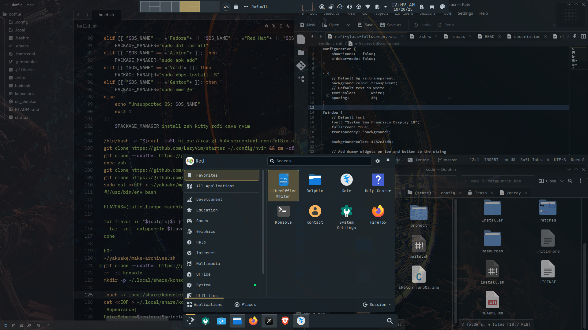
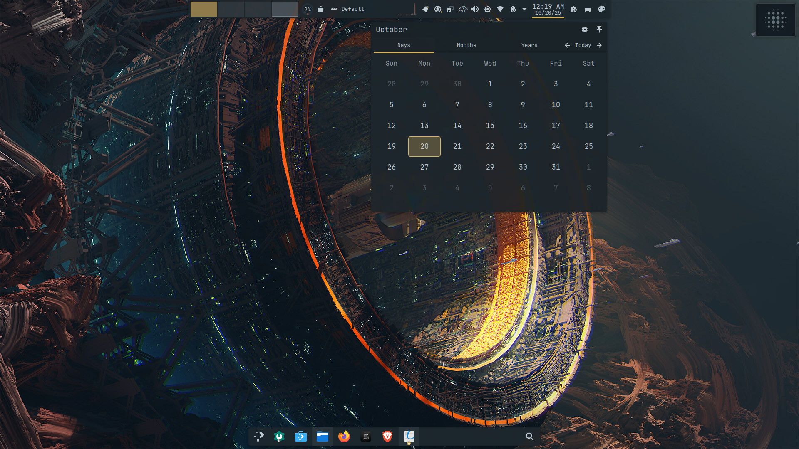
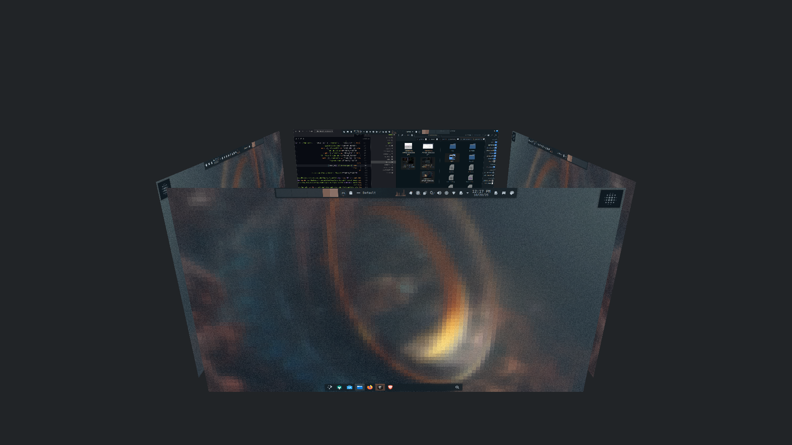

# Dotfile by RED

This is my personal catppuccin dotfile config with ****auto-install/auto-script**** file.

 

> I haven't completely finish it so there might be some errors and issues

 

In case of issues, feel free to open \Like someone even goona read this\

 
 

Anyway heres my 🍙

<h3 align="left"> FastFetch and Firefox: </h3>

  

 

<h3 align="left">  Catppuccin KDE: </h3>

  
  
 

<h3 align="left"> Desktop with Jetbrain mono: </h3>

  

 

<h3 align="left"> Cube and Wallpaper-Effects: </h3>

  

